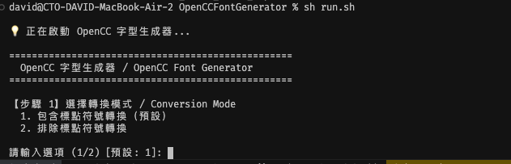
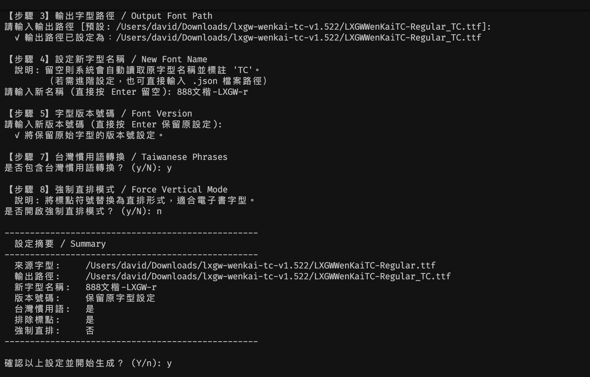

# OpenCC 字型生成器 / OpenCC Font Generator




---

## 關於本專案 / About This Fork

本專案是基於 [ayaka14732/OpenCCFontGenerator](https://github.com/ayaka14732/OpenCCFontGenerator) 的分支版本，由 [tbdavid2019](https://github.com/tbdavid2019) 維護。

感謝原作者 **ayaka14732** 的出色工作，奠定了本工具的核心基礎。本分支在原版基礎上新增了以下功能：
- `--no-punc`：可選擇性地排除標點符號的轉換
- `--force-vertical`：自動替換標點符號為直排形式（適合電子書直排字型）
- `start.py`：互動式精靈啟動器，提供引導式問答介面，降低使用門檻

---

將 OpenCC 簡繁轉換邏輯嵌入 OpenType 字型，使用者下載並安裝字型後，所有簡體中文文字將自動以繁體字形呈現，無需任何軟體設定。

> Embed OpenCC Simplified→Traditional Chinese conversion rules into an OpenType font. Once installed, any application that renders with the font will automatically display Traditional Chinese glyphs — no software configuration required.

---

## 運作原理 / How It Works

本工具在字型的 **GSUB（字形替換）表**中建立 `liga_s2t` 功能，利用 OpenCC 字典將簡體字形映射到對應的繁體字形，包含詞彙層面的多對一替換（例如「软件」→「軟體」）。

> This tool builds a `liga_s2t` GSUB feature in the font, mapping Simplified Chinese glyphs to Traditional Chinese using OpenCC dictionaries — including phrase-level ligature substitutions (e.g. 软件 → 軟體).

---

## 安裝前置需求 / Prerequisites

```bash
pip install -r requirements.txt
python setup.py build  # 下載 OpenCC 資料並生成快取
```

同時需要安裝 [otfcc](https://github.com/caryll/otfcc)（`otfccdump` 與 `otfccbuild`）。

> Also requires [otfcc](https://github.com/caryll/otfcc) (`otfccdump` and `otfccbuild`) on your PATH.

---

## 使用方法 / Usage

### 方法一：全自動快速啟動（推薦：免環境設定 & 同步友善）
如果您在 macOS 並希望自動管理環境（且不想在專案內產生 `.venv` 資料夾），請直接執行：

```bash
sh run.sh
```
此腳本會自動在 `~/.virtualenvs/` 建立一個中央虛擬環境並啟動精靈。

---

### 方法二：手動執行互動式精靈 / Interactive Wizard
如果您已自行設定好環境，請執行：

```bash
python start.py
```

執行後會逐步詢問：
1. 轉換模式（包含 / 排除標點符號轉換）
2. 來源字型路徑
3. 輸出字型路徑
4. 新字型名稱（可留空自動生成，或輸入舊版 JSON 檔案）
5. 字型版本號碼（選填，留空則保留原始）
6. TTC 索引（僅針對 .ttc 檔案詢問）
7. 是否包含台灣慣用語轉換

---

### 方法二：命令列參數 / CLI Arguments

```bash
python -m OpenCCFontGenerator \
  -i <來源字型> \
  -o <輸出字型> \
  [--font-name <新字型名稱>] \
  [-n <名稱標頭 JSON>] \
  [--font-version <版本號碼>] \
  [--ttc-index <索引>] \
  [--twp] \
  [--no-punc]
```

#### 參數說明 / Parameters

| 參數 | 說明 | 必填 |
|------|------|------|
| `-i`, `--input-file` | 來源字型路徑（.ttf / .otf / .ttc） | ✅ |
| `-o`, `--output-file` | 輸出字型路徑 | ✅ |
| `--font-name` | 新字型的名稱（建議提供） | ❌ |
| `-n`, `--name-header-file` | 進階：名稱標頭 JSON 設定檔路徑 | ❌ |
| `--font-version` | 覆寫字型版本號碼（預設保留原始版本） | ❌ |
| `--ttc-index` | TTC 檔案的字型索引（選用） | ❌ |
| `--twp` | 啟用台灣慣用語轉換（例如「軟件」→「軟體」） | ❌ |
| `--no-punc` | 排除標點符號的轉換，僅轉換漢字 | ❌ |
| `--force-vertical` | 強制直排模式（替換標點為直排形式） | ❌ |
| `--no-twp` | 停用台灣慣用語（與 `--twp` 相反） | ❌ |

#### 範例 / Example

```bash
# 基本轉換（自動生成名稱）
python -m OpenCCFontGenerator \
  -i SourceHanSansSC-Regular.otf \
  -o SourceHanSansSC-TC-Regular.otf \
  --font-version 1.0

# 指定新字型名稱
python -m OpenCCFontGenerator \
  -i SourceHanSansSC-Regular.otf \
  -o SourceHanSansSC-TC-Regular.otf \
  --font-version 1.0 \
  --font-name "Source Han Sans TC"

# 包含台灣慣用語，排除標點符號轉換
python -m OpenCCFontGenerator \
  -i SourceHanSansSC-Regular.otf \
  -o SourceHanSansSC-TC-Regular.otf \
  --font-version 1.0 \
  --twp \
  --no-punc
```

---

## 選項說明：排除標點符號 `--no-punc`

預設情況下，生成的字型會同時轉換漢字與標點符號（如 `" "` → `「 」`）。  
若不希望標點符號被改變，加上 `--no-punc` 即可：

```bash
python -m OpenCCFontGenerator ... --no-punc
```

或在互動式精靈中選擇「**2. 排除標點符號轉換**」。

---

## 選項說明：強制直排模式 `--force-vertical`

當開啟此模式時，工具會自動尋找字型內部的 `vert` 或 `vrt2` 排版功能，並將標點符號（如 `（`、`「`）的映射直接指向直排版字形。

這對於**不支援 OpenType 特性的電子書閱讀器**非常有用，讓您可以直接在水平模式下看到正確的直排標點。

在互動式精靈中請選擇「**步驟 8：開啟強制直排模式**」。

---

## 授權 / License

GPL — 任何衍生作品或採用本程式碼的專案，均須以相同授權條款開放原始碼。
