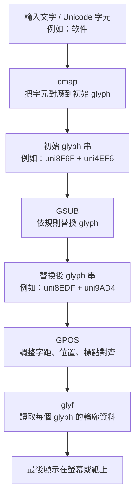

# OpenCC 字型生成器 / OpenCC Font Generator
<p align="center">
  
  
</p>

---

## 關於本專案 / About This Fork

本專案是基於 [ayaka14732/OpenCCFontGenerator](https://github.com/ayaka14732/OpenCCFontGenerator) 的分支版本，由 [tbdavid2019](https://github.com/tbdavid2019) 維護。

感谢原作者 **ayaka14732** 的出色工作，奠定了本工具的核心基礎。本分支在原版基礎上新增了以下功能：
- **WOFF2 支援**：支援 `.woff2` 作為輸入字型，並可選擇同時輸出 WOFF2 格式。
- **Webfont 生成器**：獨立的 WOFF2 轉換工具，自動產出 `@font-face` CSS 範例。
- **偽直排旋轉 (90° Rotation)**：針對舊型電子書設備，提供將字元順時針旋轉 90 度（躺平）的功能。
- **多樣化轉換標準**：支援 `s2hk` (香港)、`s2tw` (台灣) 與 `t2s` (繁轉簡) 等 OpenCC 標準。
- **字型補全 (Glyph Fallback)**：自動從備用字型提取並注入缺失的字形，徹底解決缺字 (豆腐塊) 問題。
- **通用型 Merge Font 模式**：可選擇保留來源字庫，並把 fallback 中來源缺少的所有 codepoint 一起合併進輸出字型。
- **Variable CJK Family Builder**：將 variable 拉丁字型展開成多個權重，並與對應 CJK fallback 字型合成一整套 family。
- **Static Font Family Builder**：將一個或一整組非 variable 的靜態字型批次處理，並依字重自動配對對應的 fallback 字型。
- **`--no-punc`**：可選擇性地排除標點符號的轉換。
- **`--force-vertical`**：自動替換標點符號為直排形式（適合電子書直排字型）。
- **`start.py`**：互動式精靈啟動器，提供引導式問答介面。

---

將 OpenCC 簡繁轉換邏輯嵌入 OpenType 字型，使用者下載並安裝字型後，所有文字將自動以目標字形呈現，無需任何軟體設定。

> Embed OpenCC conversion rules into an OpenType font. Once installed, any application that renders with the font will automatically display target glyphs (Traditional or Simplified) — no software configuration required.

---

## 運作原理 / How It Works

本工具在字型的 **GSUB（字形替換）表**中建立 `liga_opencc` 功能，利用 OpenCC 字典將字形映射到對應的目標字形，包含詞彙層面的多對一替換（例如「软件」→「軟體」）。

當開啟「字型補全」功能時，程式會檢查來源字型是否缺少目標字元，並自動從備用字型中抓取所需的字形數據注入到輸出字型中。
即使來源字型本身沒有 `GSUB` 或 `GPOS` 表，也可正常完成缺字補全與清理流程。

## 字型術語小教室 / Font Terms 101

如果您第一次接觸字型內部結構，可以先把字型想成一個小型資料庫：

### 什麼是 glyph？

`glyph`（字形）是字型裡實際拿來畫在螢幕或紙上的圖形單位。  
它不等於 Unicode 字元本身。

例如：
- Unicode `U+4F60` 是字元「你」
- 字型裡可能有一個 glyph 叫 `uni4F60`
- 也可能有不同 glyph 對應同一個字元，例如直排版、異體字、簡繁替代字

所以：
- **字元（character）** 是文字編碼概念
- **glyph** 是字型內部的圖形資產

### 什麼是 cmap？

`cmap` 是 **character map**，負責把「Unicode codepoint」對到「glyph」。

例如：
- `U+4F60` -> `uni4F60`
- `U+3001` -> `uni3001`

沒有 `cmap`，系統就不知道您輸入的字元應該拿哪個 glyph 來顯示。

### 什麼是 glyf？

`glyf` 是 TrueType 字型中存放 glyph 輪廓資料的表。  
它描述這個 glyph 長什麼樣子，例如：
- 輪廓點
- 曲線
- composite references（引用其他 glyph 組成新的 glyph）

可以這樣記：
- `cmap` 決定「**用哪個 glyph**」
- `glyf` 決定「**那個 glyph 長怎樣**」

### 什麼是 GSUB？

`GSUB` 是 **Glyph Substitution**，也就是「字形替換表」。

它會在排版時，把一個 glyph 或一串 glyph 換成另一個 glyph 或 glyph 串。

常見用途：
- 連字：`f` + `i` -> `fi`
- 簡轉繁：`后` -> `後`
- 詞級替換：`软件` -> `軟體`
- 直排替代字形

本專案的核心，就是大量利用 `GSUB` 來實作 OpenCC 簡繁轉換。

### 什麼是 GPOS？

`GPOS` 是 **Glyph Positioning**，也就是「字形定位表」。

它不負責換字形，而是負責調整 glyph 的位置或間距。

常見用途：
- kerning 字距微調
- 注音或重音符號定位
- 複雜文字排版時的位置修正
- 標點或組合符號的精細對齊

所以差別是：
- `GSUB` = 換 glyph
- `GPOS` = 不換 glyph，只調整位置

### 一句話總結

- `glyph`：字型裡的一個實際字形
- `cmap`：字元 -> glyph 的對照表
- `glyf`：glyph 的輪廓資料
- `GSUB`：glyph 替換規則
- `GPOS`：glyph 定位規則

### 字型渲染流程圖 / Font Rendering Flow

下面這張圖可以幫助理解：當應用程式顯示文字時，字型內部大致會經過哪些步驟。



用更白話的方式講：

1. 使用者輸入的是 Unicode 文字。
2. `cmap` 先決定每個字元要拿哪個 glyph。
3. `GSUB` 再視需要把 glyph 換成另一個 glyph，或換成整串新的 glyph。
4. `GPOS` 負責把這些 glyph 排好位置。
5. `glyf` 提供每個 glyph 的實際形狀，最後才被畫出來。

本專案做的事情，主要就是在這個流程中強化 `GSUB`，並在缺字時補上必要的 `cmap` 與 `glyf` 資料。

### 重要限制 / Important Limitation

本工具輸出的 `_TC` 字型，**不是**「完整保留原始字庫再額外加上簡繁轉換」的 full-copy 字型。

原因是 OpenType 字型的 glyph 數量上限約為 `65535`。本專案為了實現 OpenCC 的**詞彙級**轉換，會額外建立大量中介用 pseudo glyph 與 GSUB 規則；若同時完整保留原始字型的大型字庫，常會超過格式上限而無法編譯。

因此目前輸出策略是：

- 優先保留 OpenCC 詞彙級轉換所需的 Han 字與常用非 Han 範圍
- 移除部分原始字型中不在保留範圍內的字元與對應 glyph
- 加入詞彙替換所需的 pseudo glyph 與 GSUB lookup

這表示 `_TC` 輸出字型更接近「**針對 OpenCC 轉換優化的 subset font**」，而不是原字型的完整鏡像副本。

如果您的需求是：

- 盡量保留原始字型的完整字庫
- 同時仍要保有 OpenCC 的完整詞彙級轉換

那麼在大型字型上，這兩個目標可能會因 OpenType glyph 上限而互相衝突。

---

## 安裝前置需求 / Prerequisites

```bash
pip install -r requirements.txt
python setup.py build  # 下載 OpenCC 資料並生成快取 (包含新標準)
```

同時需要安裝 [otfcc](https://github.com/caryll/otfcc)（`otfccdump` 與 `otfccbuild`）。

---

## 使用方法 / Usage

### 方法一：全自動快速啟動（推薦：免環境設定 & 同步友善）
如果您在 macOS 並希望自動管理環境，請直接執行：

```bash
sh run.sh
```
此腳本會自動建立虛擬環境、建置快取並啟動精靈。

---

### 方法二：手動執行互動式精靈 / Interactive Wizard
如果您已自行設定好環境，請執行：

```bash
python start.py
```

... (Steps 1-10 unchanged)

---

### 方法三：90度順時針旋轉 (偽直排) / 90-Degree Rotation
針對僅支援水平顯示的舊型電子書設備，您可以使用此功能讓字體「躺平」，旋轉設備後即可像直排一樣閱讀。

**最佳實踐 (Best Practice):**
1. 執行 `sh run.sh`：先將您的簡體字型轉換為 **繁體字型 (如 `_TC.ttf`)**。
2. 執行 `sh run90.sh`：輸入剛生成的繁體字型，將其 **順時針旋轉 90 度**。
3. 輸出結果為 `_TC_Rotated90.ttf`。

```bash
sh run90.sh
```

**功能特點:**
- **幾何中心旋轉**: 以字元中心點旋轉，確保排版整齊。
- **僅旋轉漢字選項**: 支援中英混排，讓英數保留原樣，僅中文字躺平。
- **全域度量修正**: 自動調整字高與寬度，模擬直排等寬感。

---

### 腳本功能總覽 / Script Overview

| 腳本 | 主要功能 | 適用場景 |
|------|----------|----------|
| `run.sh` | OpenCC 轉換 (精靈) | 核心功能，將簡體字型轉為繁體 (支援 WOFF2) |
| `run90.sh` | 90度順時針旋轉 (精靈) | 進階功能，針對不支援直排的舊設備進行偽直排處理 |
| `runVF.sh` | Variable CJK Family Builder (精靈) | 將 variable 拉丁字型展開成多權重 CJK family |
| `runSTATIC.sh` | Static Font Family Builder (精靈) | 批次處理單一靜態字型或整組靜態字重 family |
| `runWEBFONT.sh` | Webfont 轉換 (精靈) | 獨立功能，將 TTF/OTF 轉為 WOFF2 並產出 CSS |
| `start.py` | 核心轉換對話入口 | 手動啟動 OpenCC 轉換精靈 |
| `start90.py` | 旋轉對話入口 | 手動啟動 90 度旋轉精靈 |
| `startVF.py` | Variable Family 對話入口 | 手動啟動 variable 拉丁 + CJK fallback 合成精靈 |
| `startSTATIC.py` | Static Family 對話入口 | 手動啟動靜態字型批次處理精靈 |
| `startWEBFONT.py` | Webfont 對話入口 | 手動啟動 Webfont 轉換精靈 |

---

### 方法四：命令列參數 / CLI Arguments

```bash
python -m OpenCCFontGenerator \
  -i <來源字型> \
  -o <輸出字型> \
  [--woff2] \
  [--config <s2t|twp|s2tw|s2hk|t2s>] \
  [--fallback-font <備用字型路徑>] \
  [--merge-mode <opencc|universal>] \
  [--font-name <新字型名稱>] \
  [--font-version <版本號碼>] \
  [--no-punc] \
  [--force-vertical]
```

#### 參數說明 / Parameters

| 參數 | 說明 | 必填 |
|------|------|------|
| `-i`, `--input-file` | 來源字型路徑（.ttf / .otf / .ttc / .woff2） | ✅ |
| `-o`, `--output-file` | 輸出字型路徑 | ✅ |
| `--woff2` | 是否額外輸出 WOFF2 格式 | ❌ |
| `--config` | OpenCC 配置（預設: `s2t`） | ❌ |
| `--fallback-font` | 備用字型路徑（用於補齊缺字） | ❌ |
| `--merge-mode` | 補字模式：`opencc` 僅補轉換目標字；`universal` 會保留來源字庫並合併 fallback 缺少字元 | ❌ |
| `--font-name` | 新字型的名稱 | ❌ |
| `--font-version` | 覆寫字型版本號碼 | ❌ |
| `--twp` | 快捷鍵：啟用台灣慣用語轉換 (等同 `--config twp`) | ❌ |
| `--no-punc` | 排除標點符號的轉換 | ❌ |
| `--force-vertical` | 強制直排模式 | ❌ |

---

## 重大功能說明：字型補全 `--fallback-font`

當您將一個原本只有簡體字的字型轉換為繁體時，如果該字型檔案中根本沒有繁體字形，轉換後的文字會變成「豆腐塊」。

現在，您可以指定一個「備用字型」（例如：思源黑體繁體版），工具會自動從中提取缺失的繁體字形並合併到您的輸出字型中。

預設情況下，`--fallback-font` 的作用是補齊轉換目標所需的缺字，不會改變本工具整體的 subset 輸出策略。

如果您需要更接近「通用型 merge font」的行為，可以改用：

```bash
python -m OpenCCFontGenerator \
  -i MyFont.ttf \
  -o MyFontMerged.ttf \
  --fallback-font FallbackFont.ttf \
  --merge-mode universal
```

`universal` 模式會：
- 保留來源字型原本的 `cmap` 字庫
- 將 fallback 字型中來源缺少的 codepoint 一起併入
- 仍可選擇疊加 OpenCC 規則

請注意：
- 大型字型更容易碰到 OpenType 約 `65535` glyph 上限
- 目前主要合併 `cmap`、`glyf` 與基本 metrics；不是完整整併兩套字型排版系統的 full font editor

## Variable CJK Family 流程

如果您的來源字型是像 `MonoLisaVariableNormal.ttf` 這類 variable font，但本身只有英數、沒有繁體中文，那麼比較務實的做法不是硬做成單一真正的 variable CJK font，而是：

1. 將 variable font 依常見權重展開成多個 static instance  
   例如：`Thin / Regular / Medium / Bold / Black`
2. 為每個權重找對應的 CJK fallback 字型  
   例如：`NotoSansTC-Regular.ttf`、`NotoSansTC-Bold.ttf`
3. 逐個權重執行 `merge_mode=universal` 合成
4. 最後輸出一整套可安裝、可選重的 CJK family

您可以直接執行：

```bash
sh runVF.sh
```

這個流程適合：
- 英數保留 variable 拉丁字型風格
- 中文由 Noto 或其他 CJK 字型補齊
- 同時保留 OpenCC 簡繁轉換能力

請注意：
- 這會得到「一整套多權重 family」
- 不是單一真正的 variable CJK 字型
- 如果 fallback 本身是 static 字型，中文部分不會真正擁有 variable interpolation 資料

## Static Font Family 流程

如果您的來源不是 variable font，而是一個或一整組靜態字型，例如：

- `MyFont-Regular.ttf`
- `MyFont-Medium.ttf`
- `MyFont-Bold.ttf`

那麼可以使用：

```bash
sh runSTATIC.sh
```

這個流程會：

1. 接受單一字型檔，或整個資料夾
2. 自動依檔名判斷字重，例如 `Regular / Medium / Bold`
3. 從 fallback 資料夾中尋找對應字重的字型
4. 逐個權重套用 OpenCC 與 fallback 合成
5. 批次輸出整組 `_TC` 字型

適合場景：

- 您手上的來源字型不是 variable font
- 想把一整組靜態字重 family 一次轉完
- 想搭配 `NotoSansTC-*` 或其他靜態 CJK fallback 字型

如果來源本身只有單一靜態字型，也可以使用這個流程；它會把它當成只有一個成員的 family 來處理。

```bash
python -m OpenCCFontGenerator \
  -i MySimplifiedFont.ttf \
  -o MyNewTraditionalFont.ttf \
  --fallback-font SourceHanSansTC-Regular.otf
```

---

## 選項說明：強制直排模式 `--force-vertical`

當開啟此模式時，工具會自動尋找字型內部的 `vert` 或 `vrt2` 排版功能，並將標點符號的映射直接指向直排版字形。適合不支援 OpenType 特性的電子書閱讀器。

---

## 授權 / License

GPL — 任何衍生作品或採用本程式碼的專案，均須以相同授權條款開放原始碼。
